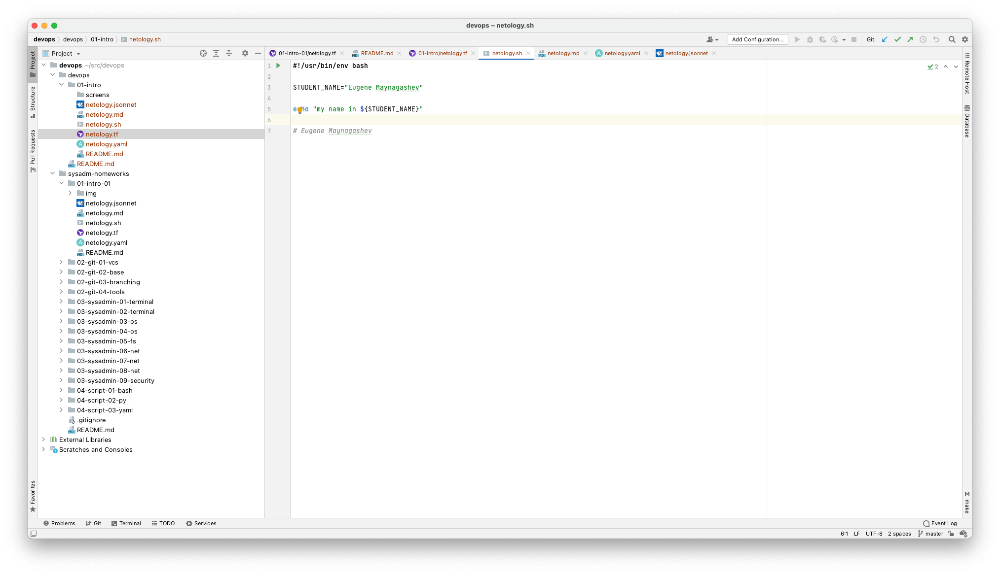
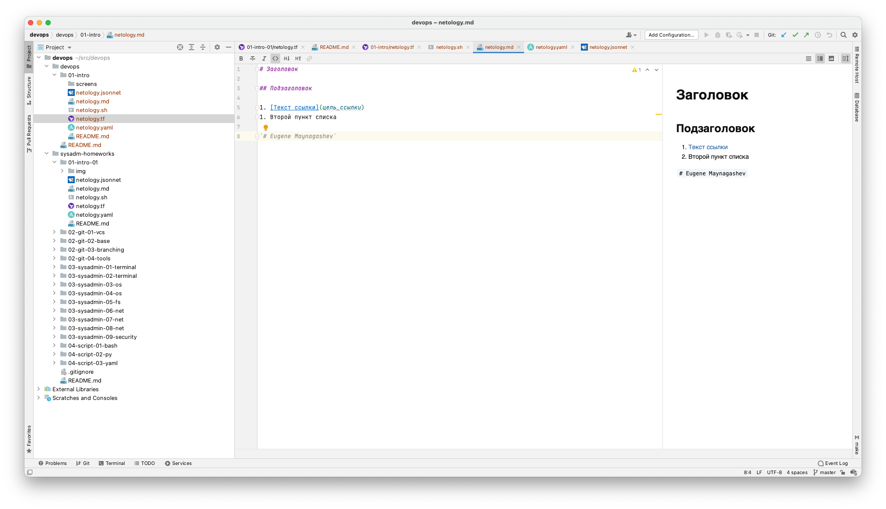
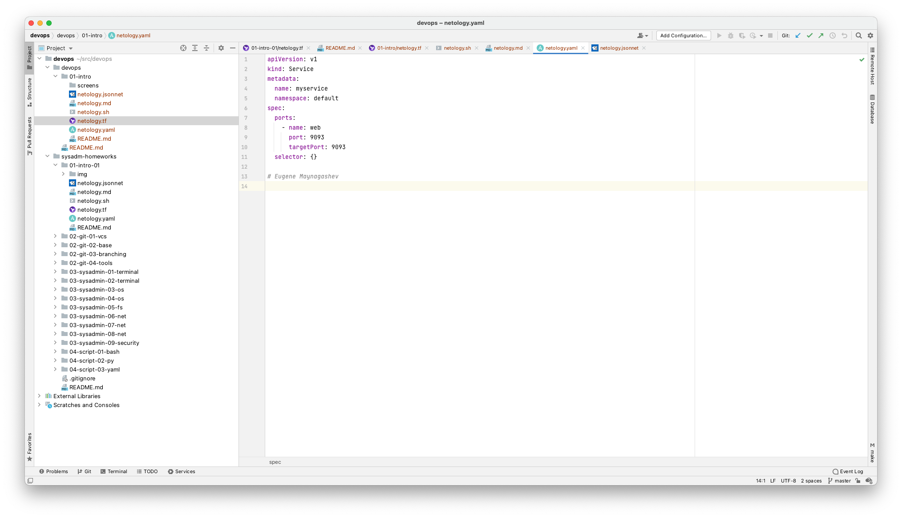
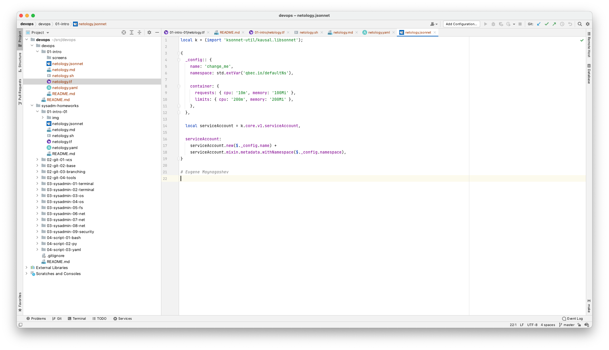

## Задание №1 - Подготовка рабочей среды

1. Добавить свое имя в каждый файл
    - [netology.tf](netology.tf) – терраформ
    - [netology.sh](netology.sh) – bash
    - [netology.md](netology.md) – markdown
    - [netology.yaml](netology.yaml) – yaml
    - [netology.jsonnet](netology.jsonnet) – jsonnet
2. Сделать снимок экрана:
    - Terraform: 
    - Bash: 
    - Markdown: 
    - Yaml: 
    - Jsonnet: 

## Задание №2 - Описание жизненного цикла задачи (разработки нового функционала)

> Необходимо описать процесс решения задачи в соответствии с жизненным циклом разработки программного обеспечения.
Использование какого-либо конкретного метода разработки не обязательно. Для решения главное - прописать по пунктам шаги
решения задачи (релизации в конечный результат) с участием менеджера, разработчика (или команды разработчиков),
тестировщика (или команды тестировщиков) и себя как DevOps-инженера.

`// todo`