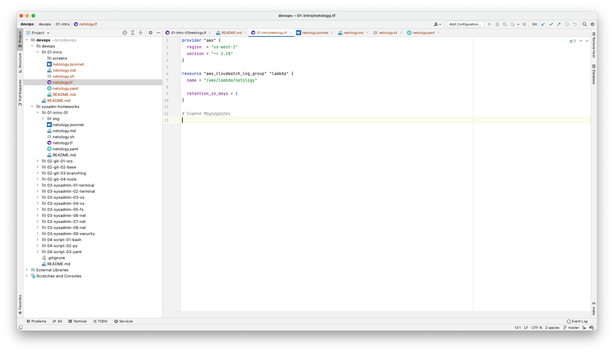

## Задание №1 - Подготовка рабочей среды

1. Добавить свое имя в каждый файл
    - [netology.tf](netology.tf) – терраформ
    - [netology.sh](netology.sh) – bash
    - [netology.md](netology.md) – markdown
    - [netology.yaml](netology.yaml) – yaml
    - [netology.jsonnet](netology.jsonnet) – jsonnet
2. Сделать снимок экрана:
    - Terraform: 
    - Bash: 
    - Markdown: 
    - Yaml: 
    - Jsonnet: 

## Задание №2 - Описание жизненного цикла задачи (разработки нового функционала)

> Необходимо описать процесс решения задачи в соответствии с жизненным циклом разработки программного обеспечения. Использование какого-либо конкретного метода разработки не обязательно. Для решения главное - прописать по пунктам шаги решения задачи (релизации в конечный результат) с участием менеджера, разработчика (или команды разработчиков), тестировщика (или команды тестировщиков) и себя как DevOps-инженера.

**Процесс решения задачи:**

- Заказчик придумывает хотелку (**запрос на фичу**) и передает ее менеджеру (посредством чата или специализированных
  систем, которые настраивают devops).
- Менеджер уточняет **требования** и детали.
- Менеджер **планирует** разработку совместно с архитекторами ПО и девопсами (которые в курсе конкретной инфраструктуры
  в компании и возможности использования готовых решения для автоматизации тех или иных частей задачи).
- Менеджер создает и **оформляет задачи** для разработчиков в трекере задач (аналогичным образом создаются задачи для
  админов, девопс-инженеров, маркетологов и т.д.).
- Менеджер **приоритизирует** задачи, назначает конкретных исполнителей (в рамках своего отдела).
- Разработчики **берут в работу** назначенные им задачи, согласно приоритету.
- Разработчики **разрабатывают** в локальном окружении (максимально близком к продакшен окружению – тут девопсы и докер
  в помощь).
- Разработчики **деплоят** готовый и локально протестированный код **в песочницу на серверах** (изолированное от
  продакшена и других фич окружение, чтобы при наличии багов последствия были минимальные). Идеально если под каждую
  фичу разворачивается свой шоурум, позволяющий полноценно протестировать фичу отдельно от других фич, которые могут
  разрабатываться параллельно.
- Во время деплоя – происходит запуск **автоматического тестирования** изменений, **статический анализ** кодовой базы, в
  том числе на **уязвимости**, в зависимости от окружения может меняться набор производимых тестов (чем ближе к
  продакшену, тем больше тестов).
- **Настройкой песочницы и всего CI/CD занимаются девопсы, т.к. тут требуются знания как инфраструктуры, так и специфики
  разрабатываемого ПО**. 
- Разработчики **проверяют** работу фичи в песочнице (необязательный этап, но желательный, чтобы
  минимизировать кол-во циклов `разработка <-> QA`).
- QA **тестирует** работу фичи в песочнице.
- По результатам тестирования, в случае успешного прохождения всех проверок – QA помечает задачу (фичу) в трекере как
  готовую к релизу. Либо, если найдены баги – возвращает на доработку в отдел разработки.
- Когда фича готова к релизу, менеджер принимает решение о **релизе** фичи.
- **Фича релизится в продакшен**. В зависимости от проекта, этот этап может включать деплой и испытания в стейджинг
  окружении (продакшен окружение, изолированное от реальных пользователей). В больших проектах, может применяться –
  постепенное развертывание фичи по серверам.
- Релиз может потребовать изменения настроек серверов, а также в инфраструктуре (добавление новых серверов, DNS записей,
  генерация сертификатов).
- После релиза QA **проверяет** работу фичи в продакшене.
- В случае обнаружения багов, фича **откатывается**. Активируется предыдущая стабильная версия ПО.
- На всех этапах разработки ведется **мониторинг** ошибок.
- В продакшене собираются **бизнес-метрики** работы фичи.
- Менеджер **отчитывается** о работе разработанной и внедренной фичи заказчику.