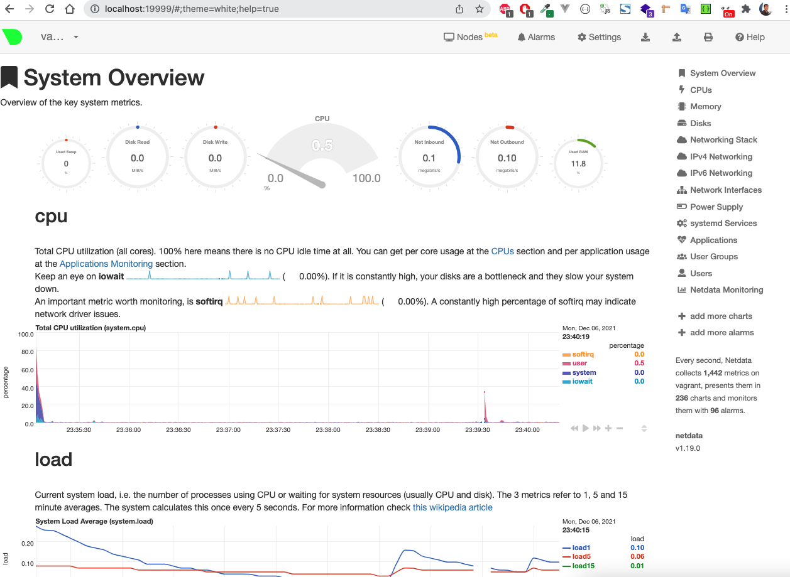

# Домашнее задание к занятию "3.4. Операционные системы, лекция 2"

### 1. На лекции мы познакомились с [node_exporter](https://github.com/prometheus/node_exporter/releases). В демонстрации его исполняемый файл запускался в background. Этого достаточно для демо, но не для настоящей production-системы, где процессы должны находиться под внешним управлением. Используя знания из лекции по systemd, создайте самостоятельно простой [unit-файл](https://www.freedesktop.org/software/systemd/man/systemd.service.html) для node_exporter:

    * поместите его в автозагрузку,
    * предусмотрите возможность добавления опций к запускаемому процессу через внешний файл (посмотрите, например, на `systemctl cat cron`),
    * удостоверьтесь, что с помощью systemctl процесс корректно стартует, завершается, а после перезагрузки автоматически поднимается.

1. Создал юзера, группу, юнит-файл и добавил автозагрузку:
```bash
```bash
root@vagrant:/home/vagrant/node_exporter-1.3.1.linux-amd64# nano /etc/systemd/system/node_exporter.service
root@vagrant:/home/vagrant/node_exporter-1.3.1.linux-amd64# systemctl status node_exporter
● node_exporter.service - Prometheus Node Exporter
     Loaded: loaded (/etc/systemd/system/node_exporter.service; disabled; vendor preset: enabled)
     Active: inactive (dead)
root@vagrant:/home/vagrant/node_exporter-1.3.1.linux-amd64# systemctl start  node_exporter
root@vagrant:/home/vagrant/node_exporter-1.3.1.linux-amd64# systemctl status node_exporter
● node_exporter.service - Prometheus Node Exporter
     Loaded: loaded (/etc/systemd/system/node_exporter.service; disabled; vendor preset: enabled)
     Active: active (running) since Mon 2021-12-06 15:25:54 UTC; 2s ago
   Main PID: 12920 (node_exporter)
      Tasks: 5 (limit: 2278)
     Memory: 2.6M
     CGroup: /system.slice/node_exporter.service
             └─12920 /usr/local/bin/node_exporter

Dec 06 15:25:54 vagrant node_exporter[12920]: ts=2021-12-06T15:25:54.145Z caller=node_exporter.go:115 level=info collector=thermal_zone
Dec 06 15:25:54 vagrant node_exporter[12920]: ts=2021-12-06T15:25:54.145Z caller=node_exporter.go:115 level=info collector=time
Dec 06 15:25:54 vagrant node_exporter[12920]: ts=2021-12-06T15:25:54.145Z caller=node_exporter.go:115 level=info collector=timex
Dec 06 15:25:54 vagrant node_exporter[12920]: ts=2021-12-06T15:25:54.145Z caller=node_exporter.go:115 level=info collector=udp_queues
Dec 06 15:25:54 vagrant node_exporter[12920]: ts=2021-12-06T15:25:54.145Z caller=node_exporter.go:115 level=info collector=uname
Dec 06 15:25:54 vagrant node_exporter[12920]: ts=2021-12-06T15:25:54.145Z caller=node_exporter.go:115 level=info collector=vmstat
Dec 06 15:25:54 vagrant node_exporter[12920]: ts=2021-12-06T15:25:54.145Z caller=node_exporter.go:115 level=info collector=xfs
Dec 06 15:25:54 vagrant node_exporter[12920]: ts=2021-12-06T15:25:54.145Z caller=node_exporter.go:115 level=info collector=zfs
Dec 06 15:25:54 vagrant node_exporter[12920]: ts=2021-12-06T15:25:54.146Z caller=node_exporter.go:199 level=info msg="Listening on" address=:9100
Dec 06 15:25:54 vagrant node_exporter[12920]: ts=2021-12-06T15:25:54.146Z caller=tls_config.go:195 level=info msg="TLS is disabled." http2=false

root@vagrant:/home/vagrant/node_exporter-1.3.1.linux-amd64# systemctl enable  node_exporter
Created symlink /etc/systemd/system/multi-user.target.wants/node_exporter.service → /etc/systemd/system/node_exporter.service.
```

2. Для дополнительных опций добавил `$NODE_EXPORTER_EXTRA_OPTS` по аналогии с юнит-файлом крона:
```bash
root@vagrant:/home/vagrant/node_exporter-1.3.1.linux-amd64# systemctl cat node_exporter
# /etc/systemd/system/node_exporter.service
[Unit]
Description=Prometheus Node Exporter
After=network-online.target

[Service]
Type=simple
User=node-exp
Group=node-exp
ExecStart=/usr/local/bin/node_exporter $NODE_EXPORTER_EXTRA_OPTS

[Install]
WantedBy=multi-user.target
```
3. Процесс корректно завершается и стартует, в том числе после перезагрузки системы:
```bash
vagrant@vagrant:~$ systemctl start node_exporter
==== AUTHENTICATING FOR org.freedesktop.systemd1.manage-units ===
Authentication is required to start 'node_exporter.service'.
Authenticating as: vagrant,,, (vagrant)
Password:
==== AUTHENTICATION COMPLETE ===
vagrant@vagrant:~$ systemctl status node_exporter
● node_exporter.service - Prometheus Node Exporter
     Loaded: loaded (/etc/systemd/system/node_exporter.service; enabled; vendor preset: enabled)
     Active: active (running) since Mon 2021-12-06 15:47:27 UTC; 4s ago
   Main PID: 1201 (node_exporter)
...
```


### 2. Ознакомьтесь с опциями node_exporter и выводом `/metrics` по-умолчанию. Приведите несколько опций, которые вы бы выбрали для базового мониторинга хоста по CPU, памяти, диску и сети.

Опции node-exporter для базового мониторинга ресурсов, например те которые и так активированы по умолчанию:
- CPU
    - `--collector.cpu`
    - `--collector.loadavg`
- Memory    
    - `--collector.meminfo`
- Disks    
    - `--collector.diskstats`
- Network
    - `--collector.netstat`
    
```bash
vagrant@vagrant:~$ curl -s localhost:9100/metrics | egrep ^[^#] | grep  node_load
node_load1 0
node_load15 0
node_load5 0
```

### 3. Установите в свою виртуальную машину [Netdata](https://github.com/netdata/netdata). Воспользуйтесь [готовыми пакетами](https://packagecloud.io/netdata/netdata/install) для установки (`sudo apt install -y netdata`). После успешной установки:
    * в конфигурационном файле `/etc/netdata/netdata.conf` в секции [web] замените значение с localhost на `bind to = 0.0.0.0`,
    * добавьте в Vagrantfile проброс порта Netdata на свой локальный компьютер и сделайте `vagrant reload`:

    ```bash
    config.vm.network "forwarded_port", guest: 19999, host: 19999
    ```

   После успешной перезагрузки в браузере *на своем ПК* (не в виртуальной машине) вы должны суметь зайти на `localhost:19999`. Ознакомьтесь с метриками, которые по умолчанию собираются Netdata и с комментариями, которые даны к этим метрикам.



### 4. Можно ли по выводу `dmesg` понять, осознает ли ОС, что загружена не на настоящем оборудовании, а на системе виртуализации?

Можно, например по следуюшим сообщениям:
```bash
vagrant@vagrant:~$ dmesg | grep virtual
[    0.003470] CPU MTRRs all blank - virtualized system.
[    0.718149] Booting paravirtualized kernel on KVM
[    5.770122] systemd[1]: Detected virtualization oracle.
```

### 5. Как настроен sysctl `fs.nr_open` на системе по-умолчанию? Узнайте, что означает этот параметр. Какой другой существующий лимит не позволит достичь такого числа (`ulimit --help`)?

`fs.nr_open` - лимит на количество открытых дескрипторов
```bash
vagrant@vagrant:~$ /sbin/sysctl -n fs.nr_open
1048576
```

`ulimit -n` - максимальное количество открытых файлов. Мягкое ограничение можно превосходить вплоть до значения соответствующего жесткого ограничения.
```bash
vagrant@vagrant:~$ ulimit -n
1024
```

`ulimit -Hn` - жесткое ограничение после установки превосходить нельзя.
```bash
vagrant@vagrant:~$ ulimit -Hn
1048576
```

### 6. Запустите любой долгоживущий процесс (не `ls`, который отработает мгновенно, а, например, `sleep 1h`) в отдельном неймспейсе процессов; покажите, что ваш процесс работает под PID 1 через `nsenter`. Для простоты работайте в данном задании под root (`sudo -i`). Под обычным пользователем требуются дополнительные опции (`--map-root-user`) и т.д.

Делаем всё под root:
```bash
vagrant@vagrant:~$ sudo -i
```

Запускаем sleep через unshare:
```bash
root@vagrant:~# unshare -f --pid --mount-proc sleep 1h
bg
^Z
[1]+  Stopped                 unshare -f --pid --mount-proc sleep 1h
root@vagrant:~# ps aux
USER         PID %CPU %MEM    VSZ   RSS TTY      STAT START   TIME COMMAND
root        9394  0.0  0.0   8080   592 pts/2    T    16:27   0:00 unshare -f --pid --mount-proc sleep 1h
root        9395  0.0  0.0   8076   528 pts/2    S    16:27   0:00 sleep 1h
root        9396  0.0  0.3  11492  3396 pts/2    R+   16:27   0:00 ps aux
```

Заходим в процесс:
```bash
root@vagrant:~# nsenter -t 9395 -p -m
root@vagrant:/# ps
    PID TTY          TIME CMD
      1 pts/2    00:00:00 sleep
      2 pts/2    00:00:00 bash
      9 pts/2    00:00:00 ps
```

### 7. Найдите информацию о том, что такое `:(){ :|:& };:`. Запустите эту команду в своей виртуальной машине Vagrant с Ubuntu 20.04 (**это важно, поведение в других ОС не проверялось**). Некоторое время все будет "плохо", после чего (минуты) – ОС должна стабилизироваться. Вызов `dmesg` расскажет, какой механизм помог автоматической стабилизации. Как настроен этот механизм по-умолчанию, и как изменить число процессов, которое можно создать в сессии?


Это так называемая `fork bomb` - рекурсивно создает форки процесса в фоне (`&`), до тех пор пока не упрется в лимиты создания процессов для юзера.

`dmesg` сообщает:
```bash
[Mon Dec  6 16:54:52 2021] cgroup: fork rejected by pids controller in /user.slice/user-1000.slice/session-5.scope
```

Судя по сообщению сработал механизм `сgroups` - это способ ограничить ресурсы внутри контрольной группы процессов, в данном случае в группу `user.slice`.  

Если во время запуска рекурсивной функции, открыть `systemd-cgtop`, то видно как растет кол-во задач в группе `user.slice`, затем стабилизируется и снижается.
```bash
vagrant@vagrant:~$ systemd-cgtop
Control Group                                                                                                                                                                                                                                                                        Tasks   %CPU   Memory  Input/s Output/s
/                         5179  131.4     1.7G        -        -
...
user.slice                5010      -     1.4G        -        -
```

- Ограничение по таскам для юзеров настраивается в `/usr/lib/systemd/system/user-.slice.d/10-defaults.conf` (общая настройка):
```bash
vagrant@vagrant:~$ cat /usr/lib/systemd/system/user-.slice.d/10-defaults.conf
...
[Slice]
TasksMax=33%
```
- По дефолту стоит `TasksMax=33%` (вероятно от лимита тасков для всех юзеров).
- Для изменения лимита, следует изменить параметр `TasksMax`, выставить новое значение, либо убрать ограничение (`TasksMax=infinity`), подробнее в [мане user@.service](https://www.freedesktop.org/software/systemd/man/user@.service.html) и в [документации suse](https://www.suse.com/support/kb/doc/?id=000019044).
